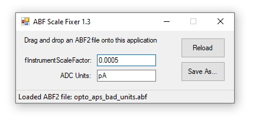

# ABF Scale Fixer
ABF Scale Fixer is tool to modify `fInstrumentScaleFactor` in the header of ABF2 files.

### Download
Compiled binaries are in [/download](/download)

### Sample Data
Sample ABFs with correct and broken scales are in [/data](/data)